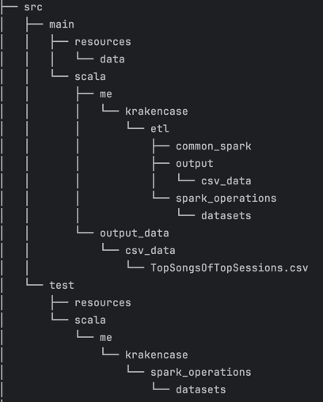

# Case Study - Last Fm

**Author: ErichDs**

### Description
This project contains the Case Study of: LastFM Top 10 Songs from Top 50 Sessions in a simple Data Platform.

The application can be run via **spark-submit**, but you MUST adjust the *application.conf* filepath variables.

**NOTE: The input data is not included in the project.**

You may want to recompile and use the .jar file located in `target/scala-2.13/casestudylastfm_2.13-0.1.0-SNAPSHOT.jar`.
To do that, you may run the cmd *sbt package* in the command prompt at Project root.

Be aware that by doing this, you may need to set up a JDK (1.8) and scala libraries (build.sbt should help with the depencies).

The etlApp can also be run by extending it with `App` and executing it in IDE.
Be aware that you'll need to remove main method, so I do not recommend it, since you'll have to change the code. 

Project Structre, Tests, Assumptions and further comments about the data and project are described in the below sections.

### Doc Sections
 - Project Structure
 - Testing
 - Assumptions & EDA Insights
 - Project Future (PROD Deployment)

### Project Structure

### Testing
All tests related to each transformation function used can be found under: `src/test/scala/me/krakencase/spark_operations/datasets`

In the spec file, you should be able to run each tests within the IDE or using sbt shell (`testOnly *SpecFileName*`).

A TestHelpers object is included in the same folder to provide some functionalities in order to achieve accurate results
while asserting datasets/schemas.

**NOTE: This project currently tests the functions logic only, check Project Future Section of this doc for further information.**

### Assumptions & EDA Insights
This solution aims to answer the Top 10 Most Played Songs of the Top 50 Longest Sessions by Track Count, with the 
following considerations:
    
1. Each session is composed by songs played within an interval of 20 minutes between each other;
2. All songs were considered: 
   - meaning that even if the same song was played 100 times respecting the previous rule, a session would be created for a single song played 100 times;
   - if a song was "skipped" before 30 seconds, that song will also be considered in a session;

That being said, the questions below should be evaluated closely if we want "improved" results:

- Should the same song played more than 100 times in a single session be taken into consideration to a session?
 
  * This could be caused by:
    * the own artist trying to put its song in the platform charts or trying to raise its play count artificially;
    * A person trying to raise the song play count artificially;
    * A bug in the platform;

- Songs skipped before 30 seconds and/or 1 minute, should be considered in a session?
    * There are cases where in a single session, some songs seems to be "skipped" in less than 30 seconds or 1 minute, this can potentially
  increase the track count for each session, leading the solution to deliver "biased" results when creating Top Sessions by Track Count;
      * This could be countered by simply filtering out songs skipped in less than X seconds;
      * Another idea would be calculating the Top 50 Sessions by Longest Playing Time;
        * Calculating the time difference between the min(timestamp) and max(timestamp) in the same date and summarizing the results by session;
        * Keep in mind that we also have to decide wether to keep songs on repeat more than N times. 

### Project Future (PROD Deployment)
There are a few points that can be better tackled for a deployment in PROD environment and it can be divided in the following categories:
1. Testing
2. Abstraction Layers
3. Dependencies Management
4. Processing Architecture

1 - For the first point, Testing, the below changes could be implemented to improve overall data quality:

- Integrity Checks: most responsible to evaluate data being loaded/processed/consumed and data quality, e.g.:
  * check for duplicates by a row_id/record_id/primary_key;
  * check missing records, if a record fail to process, route it as deadletter or load it in an staging area for further validation/deletion (bad records);
  * check for nulls;
  * consistency checks and/or cross-validation against other data sources (e.g.: records match by user_id between sessions and users table);
  * Data types and/or schema validation checks;
- Integration Tests: most responsible to evaluate communication within the data platform, e.g.:
  * top-down testing integration with kafka by sending mocked data, consuming the topic and evaluating results and communication.
  * top-down testing integration with Hive by persisting mocked data, reading the table and evaluating results.

2 - For the second point, I admit that I could have created better abstractions in order to wrap spark sessions to be reused easily
among objects in the package and avoid conflicts, but given the time and currently work, I wasn't able to implement it the way I imagined.

A better approach could be declaring a spark session as an `implicit val` in a package-level object, so every application could benefit from it, and tests woud also be able to
initialize a local spark session.

3 - the third point is related to the environment, the project is currently using sbt to minimally download a few dependencies, but in terms of PROD environment
a Maven or Private Maven Repository could also be used to better manage environment dependencies and easily resolve conflicts between sdks (which was a real pain in my old machine)

4 - For this last point I'd like to say that, for the sake of the case, I kept things "simple".

The medallion architecture is an approach that relies on different processing layers, that incrementally improves the data quality.
This approach would need more storage resources but gives in exchange the ability to rebuild downstream tables as a form of disaster recovering or,
by the simple need to add a additional columns.

E.g.:
We define a landing table that receives raw data and keep it available for processing in the next layer (Silver);
The Silver layer is mostly responsible to clean, filter or transform data to an improved format/schema.
Standardization also occurs, mostly by follow a naming pattern for columns.

We finally arrive at a Gold Layer, which is the phase of transforming data to a more refined model that meets specific needs.
Those can be analytics requirements to aggregate data or enriching information from other sources (in this case, it would be user information)

I opted to not follow an specific pattern at this time, since it's a simple transforming application, so I don't feel it would actually be necessary.
However, a production environment where the data matters, different approaches may be considered.

Keep in mind that medallion architecture does not exclude the need for data models, e.g.: star-schema.

